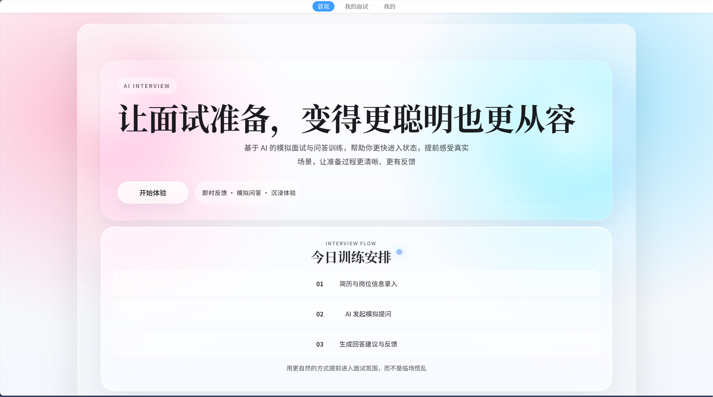
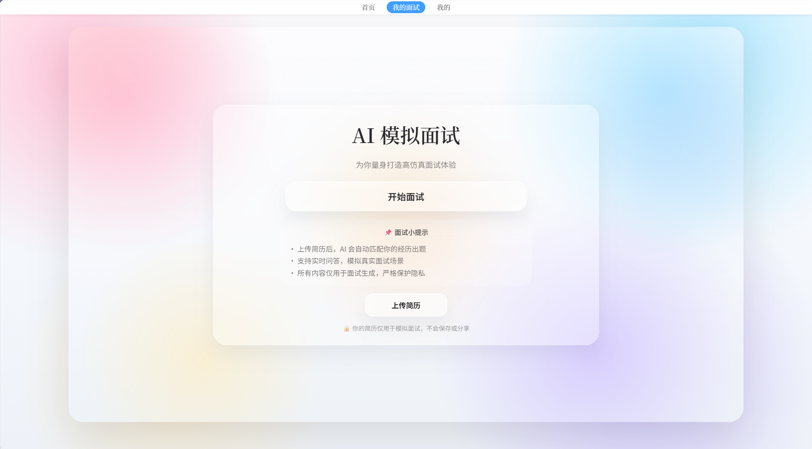
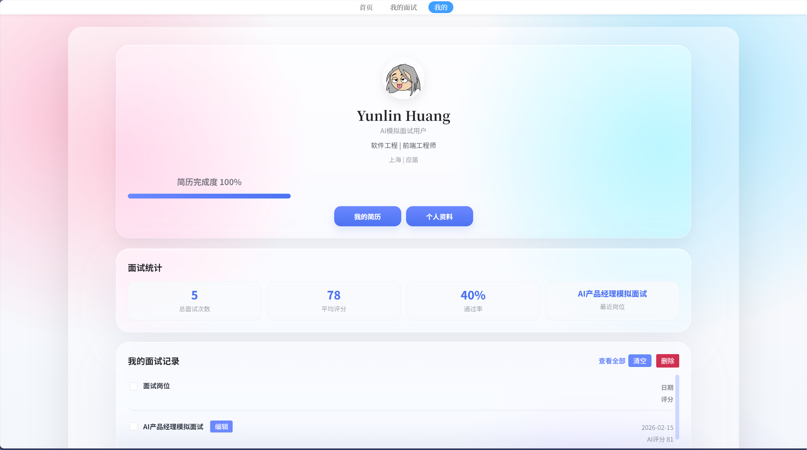

  
  <h1>AI Interview</h1>
  
<em>让面试准备，变得更聪明也更从容。</em>

  
支持 Web、桌面端、手机端的 AI 面试模拟平台。

  

    
    
    
    
  

  

    
    
    
    
  

---

## 简介

AI Interview 是一个面向求职训练、课程演示与日常练习的 AI 面试模拟平台，提供简历分析、岗位匹配、模拟问答、面试反馈与结果复盘等完整体验。

这是 **发布仓库的同步源 README**，公开仓库会同步这份文档与相关展示资源。

## 在线体验

- DEMO：<https://aiiv.zdzd.xyz>

如果你想立刻开始使用，推荐直接打开在线 DEMO。

## 下载

### 桌面端下载

前往 Release 页面获取最新安装包：

- 最新版本：<https://github.com/SsuJojo/AI-Interview-Release/releases/latest>
- 所有版本：<https://github.com/SsuJojo/AI-Interview-Release/releases>

适合以下场景：

- 希望获得更稳定的桌面使用体验
- 需要窗口化使用
- 希望像普通应用一样安装和打开

### 网页版使用

无需下载，打开即可使用：

- 在线地址：<https://aiiv.zdzd.xyz>

适合以下场景：

- 快速体验
- 临时使用
- 跨设备访问
- 手机直接打开

## 平台支持

### 桌面端

可从 Release 页面下载对应版本：

- Windows
- macOS
- Linux

> 实际可下载平台以 Release 附件为准。

### 手机端

支持手机浏览器直接访问：

- Android
- iPhone

手机端推荐直接访问：

- <https://aiiv.zdzd.xyz>

## 功能亮点

- AI 模拟面试
- 简历解析与个人画像
- 岗位推荐与匹配分析
- 面试统计与记录查看
- 评分反馈与复盘建议
- 支持网页端、桌面端、手机端

## 界面预览

### 首页

### 模拟面试

### 个人中心

## 如何选择使用方式

- 想马上体验：直接打开网页 DEMO
- 想获得更完整的应用体验：下载桌面端
- 想在手机上练习：用手机浏览器访问 DEMO
- 想获取最新版：前往 Release 页面下载

## 推荐使用流程

1. 打开 DEMO 快速体验产品能力
2. 如果需要长期使用，再下载桌面端版本
3. 在桌面端完成更完整的模拟面试与记录查看
4. 在手机端进行碎片化练习

## 贡献者

感谢所有参与本项目的人。

## 快速入口

- 在线 DEMO：<https://aiiv.zdzd.xyz>
- 最新版本下载：<https://github.com/SsuJojo/AI-Interview-Release/releases/latest>
- Release 列表：<https://github.com/SsuJojo/AI-Interview-Release/releases>

## 说明

- 公开仓库 README 与展示资源由当前仓库同步生成
- 安装包、版本更新与平台支持情况请以 Release 页面为准
- 若只想快速开始，网页版通常已经足够
